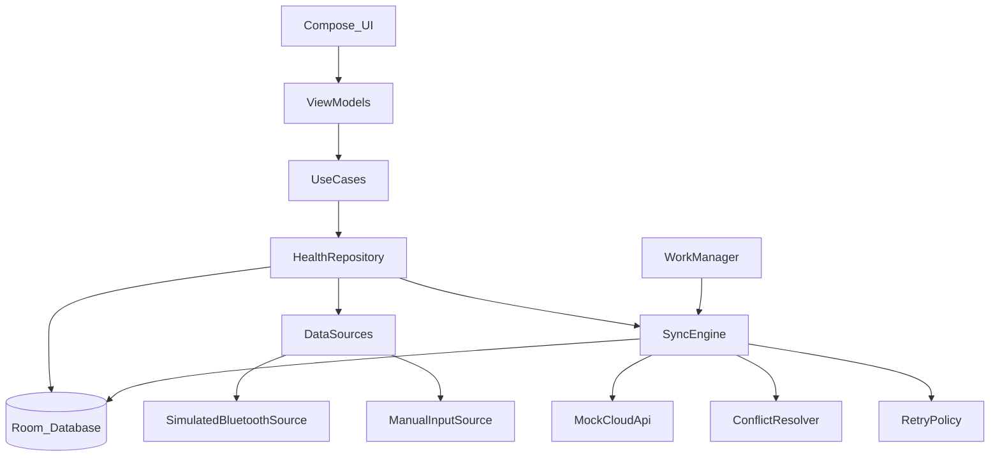
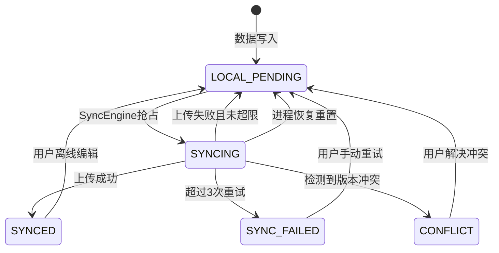
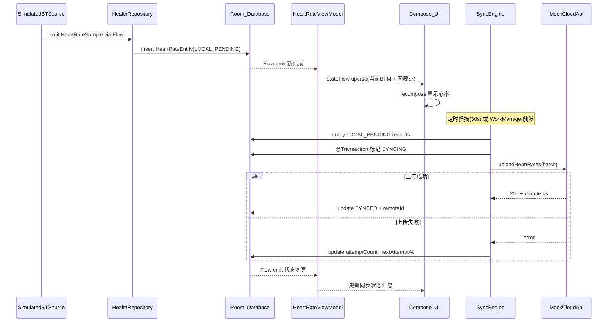

# HealthSync 设计文档（docs/DESIGN.md）

> 目标：以**数据层架构**为核心，完成"多数据源 + 离线优先 + 可恢复同步 + 冲突处理 + 可观测状态"的最小闭环；UI 用 Jetpack Compose 验证完整链路。

---

## 1. 背景与范围

### 1.1 背景
- 产品：智能手环 + 手机 App，同步心率/步数/睡眠数据。
- 本项目：不接真实蓝牙，使用模拟数据源；云端使用 mock REST API。

### 1.2 目标（Goals）
- **可扩展数据源**：新增真实蓝牙/Health Connect 数据源时，不修改同步引擎核心代码（只新增实现 + DI 注册）。
- **离线优先**：所有数据先写入 Room；网络同步异步进行。
- **可恢复同步**：同步中杀进程/重启后，可恢复未完成任务。
- **同步状态可见**：每条数据有状态（本地/同步中/已同步/失败/冲突），UI 可汇总待同步数量。
- **冲突可处理**：实现并记录冲突策略（睡眠记录离线修改导致冲突）。
- **可测试**：数据层核心逻辑单元测试覆盖率 > 60%（重试/状态机/冲突/并发写入）。

### 1.3 非目标（Non-Goals）
- 不实现真实蓝牙协议、真实云端、账号体系。
- 不追求 UI 视觉完美；优先证明数据链路与可靠性。

---

## 2. 架构总览

### 2.1 分层与职责
- **UI（Jetpack Compose）**：只渲染 `ViewModel` 暴露的 `StateFlow`；触发"下拉刷新同步"等意图。
- **ViewModel（MVVM）**：聚合多个 Flow 为 UI 状态；发起同步/录入睡眠等 UseCase。
- **Domain（UseCases）**：定义业务入口（开始/停止数据源、触发同步、保存睡眠、订阅汇总指标）。
- **Data Layer**：
  - `DataSource`：统一抽象"数据产生"，提供数据流与连接状态流。
  - `Repository`：统一入口，写入 Room、读取 Flow、聚合统计（待同步数量等）。
  - `SyncEngine`：扫描 outbox/待同步记录；上传 mock API；指数退避重试；冲突处理；恢复策略。
  - `Room`：事实来源（source of truth），承载状态机字段与重试计划字段。
  - `CloudApi`：mock REST，模拟网络延迟与失败。
- **DI（Hilt）**：绑定接口到实现；新增数据源只需新增 `@Binds` / `@Provides` 注册。

### 2.2 依赖关系图（Mermaid）


---

## 3. 关键设计决策

> 写作模板：**备选方案** → **为什么选择** → **trade-off**。

### 3.1 决策 1：Room 作为事实来源（离线优先）
- **备选**：
  - A. 内存缓存为主，Room 只做持久化镜像
  - B. 网络直写 + 本地回填
- **选择**：Room 为唯一事实来源，任何数据先落库；同步引擎只从 Room 扫描待同步数据。
- **trade-off**：需要更多表字段与状态维护，写入路径必须稳定可靠；但换来完整的离线能力和可恢复性——进程被杀后数据不丢失，重启即可继续同步。

### 3.2 决策 2：Outbox + 状态机驱动同步（而非 UI/VM 直接调 API）
- **备选**：
  - A. ViewModel 触发上传并在内存持有队列
  - B. 仅依赖 WorkManager 一次性任务，无本地状态机
- **选择**：在 Room 持久化 `syncState / attemptCount / nextAttemptAt / lastError`，同步引擎周期扫描并推进状态。
- **trade-off**：实现更复杂（需维护状态转换与事务），但带来三大收益：**可恢复**（进程重启不丢任务）、**可观测**（UI 直接查询同步状态）、**可测试**（状态机的每个转换都是确定性的）。

### 3.3 决策 3：冲突策略 = "保留双方并标记冲突"
- **备选**：
  - A. LWW（Last Write Wins）——客户端优先或服务端优先
  - B. 字段级三方合并（类似 git merge）
- **选择**：遇到冲突时不丢弃任何一方数据，将记录置为 `CONFLICT`，同时存储服务端快照（`serverSnapshot` 字段或单独表），由用户/后续逻辑决定如何解决。
- **trade-off**：需要额外的 `CONFLICT` 状态与解决入口（即使本项目不做完整 UI，也要有 UseCase 支持解除冲突）；但**不丢数据**是离线优先系统最重要的保证，LWW 在睡眠记录场景会静默覆盖用户手动修改，体验不可接受。

### 3.4 决策 4：选择 Hilt 而非 Koin 作为 DI 框架
- **备选**：
  - A. Hilt（基于 Dagger，编译时生成代码）
  - B. Koin（纯 Kotlin DSL，运行时解析）
- **选择**：Hilt。
- **理由**：
  - Hilt 是 Android Jetpack 官方推荐的 DI 方案，与 ViewModel、WorkManager 等组件有原生集成（`@HiltViewModel`、`@HiltWorker`）
  - 编译时校验依赖图，缺少绑定会在编译期报错而非运行时崩溃——对本项目多接口/多实现的数据源体系尤为重要
  - `@InstallIn` 的 scope 机制天然匹配 Android 组件生命周期
- **trade-off**：编译速度略慢于 Koin；Dagger 注解学习曲线较陡；但本项目规模可控，编译开销可接受。

---

## 4. 数据源抽象（可扩展）

### 4.1 统一接口

```kotlin
interface HealthDataSource {
    // 数据事件流：数据源产生的所有健康事件都通过该流向外发送（Repository 订阅并落库）。
    val dataEvents: Flow<HealthEvent>
    // 连接状态流：用于 UI 展示与同步/采集策略判断（例如断连时暂停产生数据）。
    val connectionState: Flow<ConnectionState>
    // start/stop 约定：应当幂等；重复调用不应抛异常（便于恢复与重试场景）。
    suspend fun start()
    suspend fun stop()
}

enum class ConnectionState {
    CONNECTED, DISCONNECTED, RECONNECTING
}
```

### 4.2 HealthEvent 事件模型（sealed class）

```kotlin
sealed class HealthEvent {
    data class HeartRateSample(
        val timestamp: Long, // ms 时间戳；统一使用 epoch millis 便于跨层传递与排序
        val bpm: Int,        // 心率值（bpm）；范围校验可在数据源侧或写入用例侧完成
        val sourceId: String // 数据来源标识；用于区分模拟蓝牙/手动输入/未来 Health Connect 等
    ) : HealthEvent()

    data class StepCountIncrement(
        val timestamp: Long, // ms 时间戳；步数是增量事件（append-only）
        val steps: Int,      // 本次增加的步数（增量而非累计）；便于离线合并与追溯
        val sourceId: String // 数据来源标识
    ) : HealthEvent()

    data class SleepRecord(
        val id: String,      // 业务主键（UUID）；离线创建时即可生成，避免与云端/其他设备冲突
        val startTime: Long, // ms 时间戳
        val endTime: Long,   // ms 时间戳；要求 endTime > startTime（由 UseCase/验证层保证）
        val quality: SleepQuality, // 质量枚举；用于展示与冲突合并策略
        val sourceId: String       // 数据来源标识（手动输入通常为固定值）
    ) : HealthEvent()
}

enum class SleepQuality { POOR, FAIR, GOOD, EXCELLENT }
```

所有数据源产生的事件统一为 `HealthEvent` 子类型，Repository 负责将其分发到对应的 DAO 写入。未来新增数据类型（如血氧）只需：新增 `HealthEvent` 子类 + 对应 Entity + DAO，不修改 `HealthDataSource` 接口。

补充说明：SleepRecord 的 id / quality / sourceId

### 1 为什么 SleepRecord 需要 id（而心率/步数事件不需要业务 id）
- **睡眠记录是可编辑业务对象**：同一条记录会经历“创建 → 修改 → 同步 → 再修改”，需要稳定标识把多次更新关联到同一条记录，因此在事件模型中显式携带 `id`（UUID）。
- **心率样本/步数增量是 append-only 事件**：每条都是不可变的新事件，不存在“更新同一条”的业务语义；本地入库时用 Room `autoGenerate` 主键即可，无需在事件模型中携带业务 id。

### 2 SleepQuality 怎么用
- **展示与统计**：UI 将 `POOR/FAIR/GOOD/EXCELLENT` 映射为文案/颜色/图标，并可做按天/周的质量分布与汇总指标。
- **冲突解决（可合并字段之一）**：发生 409 冲突时，服务端版本会随 `serverSnapshot` 返回；解决冲突时需要在本地/远端/合并版本中确定 `quality` 的取值。

### 3 sourceId 的作用
- **标识数据来源**：区分模拟蓝牙、手动录入、未来 Health Connect/真实蓝牙等来源。
- **便于过滤/分组与排障**：历史页可按来源筛选；同步失败或异常数据可快速定位是哪一路产生的；必要时也可对不同来源应用不同校验与策略。

### 4.3 数据源实现
- **SimulatedBluetoothSource**
  - 每 2 秒：发出 `HeartRateSample(bpm = 60..120 随机)`
  - 每 30 秒：发出 `StepCountIncrement(steps = 1..20 随机)`
  - 支持模拟断连：内部 `connectionState` 流切换为 `DISCONNECTED`，暂停数据产生；一段时间后自动切回 `RECONNECTING → CONNECTED` 恢复产生
- **ManualInputSource**
  - 用户录入/修改睡眠记录（新增、编辑都走同一写入通道）
  - `connectionState` 始终为 `CONNECTED`（手动输入不依赖外部连接）
  - 必须能在离线状态下修改"已同步"的记录，以触发冲突链路

### 4.4 扩展性补充：避免“新增数据类型就要改 Repository/SyncEngine”

#### 4.4.1 问题
虽然 `HealthDataSource` 接口不需要修改，但若 Repository 用 `when(event)` 分发入库、SyncEngine 逐表扫描并调用不同 endpoint，则每新增一种数据类型（如血氧）仍要修改旧代码（Repository/SyncEngine），不符合“未来扩展不修改现有代码”的目标。

#### 4.4.2 方案：用 DI 注册 EventHandler/SyncAdapter（新增类型只加实现 + 绑定）
引入两类可插拔组件，交由依赖注入（Hilt multibinding）管理：
- `EventHandler`：负责把某类 `HealthEvent` 落库（含校验、映射、DAO 写入）
- `SyncAdapter`：负责从本地查询待同步记录、执行上传、回写同步结果（含批量策略）

Repository 只做两件事：
1. 收集所有 DataSource 的 `dataEvents`，交给已注册的 `EventHandler` 链处理（谁能处理谁消费）
2. 提供统一的查询 Flow（各表 DAO 仍可独立暴露给 ViewModel/UseCase）

SyncEngine 只做两件事：
1. 遍历所有已注册的 `SyncAdapter`，按其策略拉取“可同步任务”（`nextAttemptAt <= now`）
2. 统一执行“事务抢占 → 上传 → 回写状态/重试计划”的流程骨架，但具体数据类型的序列化与 API 调用封装在各自 Adapter 内

扩展方式：
- 新增数据类型（例如 BloodOxygen）时，只新增：
  - `HealthEvent.BloodOxygenSample`
  - `BloodOxygenEntity/Dao`
  - `BloodOxygenEventHandler`
  - `BloodOxygenSyncAdapter`
  - Hilt 绑定（multibinding）
- 不修改现有 Repository/SyncEngine 核心代码

#### 4.4.3 当前实现状态（技术债务）

> **现状**：当前 `HealthRepository.handleEvent` 仍使用 `when(event)` 逐类型分发入库，`SyncEngine.syncOnce()` 也为每种数据类型编写了独立的同步方法（`syncHeartRates / syncStepCounts / syncSleepRecords`）。这意味着新增数据类型时，仍需修改 Repository 和 SyncEngine 的代码。
>
> **原因**：在 Milestone 5/6 阶段，数据类型仅三种（心率/步数/睡眠），引入 EventHandler/SyncAdapter + Hilt multibinding 的抽象成本较高，投入产出比不划算。优先保证核心同步链路的正确性与可测试性。
>
> **后续计划**：当需要新增第四种数据类型（如血氧）时，应优先重构为 §4.4.2 所述的可插拔架构，避免 Repository/SyncEngine 膨胀为"上帝类"。

---

## 5. 本地数据模型与同步状态机

### 5.1 同步状态枚举

```kotlin
enum class SyncState {
    LOCAL_PENDING,  // 本地新增/修改，待同步
    SYNCING,        // 同步引擎已抢占处理中
    SYNCED,         // 已与云端一致
    SYNC_FAILED,    // 超过最大重试次数
    CONFLICT        // 检测到冲突，保留双方版本等待处理
}
```

状态转换图：



### 5.2 核心 Entity 定义

#### HeartRateEntity

| 字段 | 类型 | 说明 |
|---|---|---|
| `id` | Long (PK, autoGenerate) | 本地主键 |
| `timestamp` | Long | 采样时间戳（ms） |
| `bpm` | Int | 心率值 |
| `sourceId` | String | 数据源标识 |
| `syncState` | SyncState | 同步状态 |
| `attemptCount` | Int | 已重试次数（从 0 开始） |
| `nextAttemptAt` | Long | 下次允许重试的时间戳 |
| `lastError` | String? | 最近一次同步错误信息 |
| `remoteId` | String? | 云端记录 ID（同步成功后回写） |

#### StepCountEntity

| 字段 | 类型 | 说明 |
|---|---|---|
| `id` | Long (PK, autoGenerate) | 本地主键 |
| `timestamp` | Long | 记录时间戳 |
| `steps` | Int | 步数增量 |
| `sourceId` | String | 数据源标识 |
| `syncState` | SyncState | 同步状态 |
| `attemptCount` | Int | 已重试次数 |
| `nextAttemptAt` | Long | 下次允许重试的时间戳 |
| `lastError` | String? | 最近一次同步错误信息 |
| `remoteId` | String? | 云端记录 ID |

#### SleepRecordEntity

| 字段 | 类型 | 说明 |
|---|---|---|
| `id` | String (PK) | 业务主键（UUID，保证离线创建不冲突） |
| `startTime` | Long | 睡眠开始时间 |
| `endTime` | Long | 睡眠结束时间 |
| `quality` | SleepQuality | 睡眠质量 |
| `sourceId` | String | 数据源标识 |
| `syncState` | SyncState | 同步状态 |
| `attemptCount` | Int | 已重试次数 |
| `nextAttemptAt` | Long | 下次允许重试的时间戳 |
| `lastError` | String? | 最近一次同步错误信息 |
| `remoteId` | String? | 云端记录 ID |
| `remoteVersion` | Int | 上次同步时的云端版本号 |
| `baseRemoteVersion` | Int | 本次编辑基于的云端版本号（用于冲突检测） |
| `localVersion` | Int | 本地编辑版本号（每次编辑 +1） |
| `serverSnapshot` | String? | 冲突时存储的服务端数据 JSON 快照 |

> 设计说明：心率和步数为只增数据（append-only），不存在用户编辑场景，因此不需要 `localVersion / baseRemoteVersion / serverSnapshot` 等冲突字段；睡眠记录作为可编辑数据，需要完整的冲突检测字段。SleepRecordEntity 使用 UUID 作为主键，避免离线创建时的主键冲突。

### 5.3 并发写入保证
原则：**所有写入通过 Repository/DAO，避免 UI 或数据源直接操作数据库**。
- Room 本身线程安全（底层 SQLite WAL 模式），但需要：
  - 合理主键策略（心率/步数用 autoGenerate，睡眠用 UUID）
  - 同步引擎"抢占任务"时使用 `@Transaction`，保证 `SELECT → UPDATE syncState` 的原子性
  - 两个数据源同时写入不同表时互不阻塞；写入同一表时 Room/SQLite 串行化保证不丢数据

### 5.4 数据链路流转补充
数据源实现产生 HealthEvent → Repository把事件转成 Entity 写入 Room → SyncEngine扫描 Entity 的状态字段上传云端并回写 → UI 订阅 Room 的 Flow 实时更新。
---

## 6. 同步引擎（SyncEngine）

### 6.1 触发方式

采用 **WorkManager 周期任务 + 手动触发** 双轨机制：

- **WorkManager PeriodicWorkRequest**：每 15 分钟（WorkManager 最小周期）执行一次同步扫描。使用 `@HiltWorker` 注入依赖。即使 App 被杀，系统也会按计划唤起 Worker 执行同步。
- **App 内前台推进（推荐）**：App 在前台时，`SyncEngine` 通过 `applicationScope` 启动一个“持续推进循环”，反复执行“扫描→抢占→上传→回写”，直到当前没有可同步记录为止；若仅剩记录的 `nextAttemptAt` 尚未到达，则 `delay()` 到最近的 `nextAttemptAt` 再继续（可设置上限，例如最多等待 30s，以避免长时间挂起）。
  - 这样可以让 `RetryPolicy` 的 2s/4s/8s 级别退避在前台真正生效，而不会被固定 30s 轮询粒度吞掉。
  - App 退到后台时停止该循环，避免持续唤醒；后台由 WorkManager 周期任务兜底。
- **手动刷新**：历史页下拉刷新、UI 按钮触发一次即时同步。
- **启动恢复**：Application.onCreate 时调用 `SyncEngine.recover()`，将停留在 `SYNCING` 状态的记录重置为 `LOCAL_PENDING`（保留 `attemptCount`），然后立即触发一轮同步扫描。

> 为什么双轨：WorkManager 保证进程被杀后仍能恢复同步，但最小周期 15 分钟对前台实时体验不够；协程轮询在前台提供快速响应，两者互补。

> 补充说明：`nextAttemptAt` 是“最早允许重试时间（not-before）”，并不保证到点立刻执行；若采用固定间隔扫描，实际重试会被扫描粒度量化。前台持续推进循环通过“对齐最近 nextAttemptAt”能避免这一问题。

> 并发补充：前台持续推进循环、WorkManager Worker、手动刷新、启动恢复等都可能触发同步。为避免重复处理同一条记录，抢占阶段必须在事务中将记录原子标记为 `SYNCING`（见 6.2 第 2 步），其他执行者抢占失败则跳过该记录。为减少资源浪费，`SyncCoordinator` 内使用 `Mutex.tryLock()` 作为“进程内单实例运行锁”：当同步已在运行时，新触发直接跳过（skip）而非排队等待或启动第二个循环——正在执行的 `syncOnce()` 会扫描所有 pending 记录，因此被跳过的触发不会丢失数据；当同步未在运行时（例如前台循环正处于 `delay()` 等待阶段），`tryLock()` 立即获得锁，新触发正常执行一轮完整的同步扫描，等效于提前唤醒空闲循环。同时 WorkManager 使用 UniqueWork 避免重复排程。
>
> **已知局限（当前不做优化）**：`syncOnce()` 按 HeartRate → StepCount → SleepRecord 顺序依次扫描，若新记录在某类型扫描完成后才插入，该记录会被当前 pass 漏掉。多数情况下 `syncOnce()` 返回 `true`，前台循环立即进入下一轮（毫秒级延迟），影响可忽略；但若当前 pass 恰好三类均无数据（`syncOnce()` 返回 `false`），循环将进入 `delay()`（最长 30s），新记录需等到 delay 结束后才被处理。彻底消除此窗口需引入信号机制（如 `Channel` 或取消 delay 的 Job），在 Repository 写入时主动唤醒循环；当前阶段 30s 最大延迟可接受，暂不实现。

### 6.2 同步流程（高层）
1. 查询待同步记录：`syncState in (LOCAL_PENDING, SYNC_FAILED)` 且 `nextAttemptAt <= now`
2. 抢占任务：`@Transaction` 内将记录标记为 `SYNCING`（避免 WorkManager 和协程轮询重复上传同一条）
3. 调用 `MockCloudApi` 上传（模拟 delay 与失败）
4. 成功：写回 `SYNCED` + `remoteId` + 清理错误字段
5. 冲突（HTTP 409）：进入冲突处理流程（见 Section 7）
6. 其他失败：计算指数退避，更新 `attemptCount / nextAttemptAt / lastError`
7. 超过 3 次：置为 `SYNC_FAILED`

### 6.3 指数退避策略（RetryPolicy）

```kotlin
class RetryPolicy(
    val maxAttempts: Int = 3,
    val baseDelayMs: Long = 2_000L,
    val maxDelayMs: Long = 30_000L
) {
    fun nextDelay(attemptCount: Int): Long {
        // attemptCount 从 0 开始：0->~2s，1->~4s，2->~8s...（指数退避）
        val delay = baseDelayMs * (1L shl attemptCount) // 2^n
        // jitter 用来打散同一时刻的重试，避免“惊群效应”
        val jitter = (delay * 0.1 * Random.nextDouble()).toLong()
        return (delay + jitter).coerceAtMost(maxDelayMs)
    }

    // 达到上限后由 SyncEngine 将记录置为 SYNC_FAILED（不再自动重试）
    fun shouldRetry(attemptCount: Int): Boolean = attemptCount < maxAttempts
}
```

- 第 1 次失败后等待 ~2s，第 2 次 ~4s，第 3 次超限置为 `SYNC_FAILED`
- 加入 10% jitter 避免多条记录同时重试产生"惊群"

### 6.4 杀进程恢复策略

启动恢复时处理 `SYNCING` 状态的记录：
- **策略**：`Application.onCreate` → `SyncEngine.recover()` 将所有 `syncState == SYNCING` 的记录重置为 `LOCAL_PENDING`，保留 `attemptCount`。
- **原因**：应用被杀时无法确认上传是否已到达服务端；回到 `LOCAL_PENDING` 让同步引擎重新推进。为避免“重放”导致云端重复数据，需要接口与数据模型具备幂等/去重能力（见 6.5）。
- **WorkManager 兜底**：即使 App 未被用户重新打开，WorkManager 的周期任务也会执行恢复 + 同步。

## 6.5 幂等性与去重（防止重放导致云端重复数据）

### 6.5.1 为什么必须做幂等/去重
在离线优先系统里，以下情况会导致“同一批数据被重复上传（重放）”：
- 网络抖动导致客户端重试，但服务端其实已收到（客户端未拿到响应）
- 同步过程中 App 被杀，启动恢复（recover）把 `SYNCING` 重置回 `LOCAL_PENDING`，下一轮同步会再次尝试上传
- WorkManager 与前台同步循环交替触发，可能产生重复提交（即使本地通过事务抢占避免“同一条记录并发上传”，仍可能出现“先上传成功但未回写 SYNCED 就被杀”导致的重放）

若云端接口是“追加写入（append）”语义（如 POST 批量上传），则重放会导致云端重复插入，最终造成：
- 心率样本数量膨胀（图表点数异常）
- 步数被重复累计（今日步数虚高）
因此必须在设计上保证“重复上传不会改变最终结果”，即幂等（或至少可去重）。

### 6.5.2 方案选择：客户端生成 eventId + 服务端按 eventId 去重（推荐）
对 HeartRate 与 StepCount 这类 append-only 事件，引入稳定事件标识 `eventId`：
- 客户端在落库时生成 `eventId = UUID`
- 本地 Room 表增加字段 `eventId`，并建立唯一索引，避免本地重复写入
- 云端存储按 `eventId` 去重：同一 `eventId` 重复上报时，服务端返回 200/208（或 200 + same remoteId），但不重复插入
- 同步成功回写 `remoteId` 仅作为调试/追踪字段；幂等性的关键是 `eventId`

API 合约调整建议：
- `POST /api/heart-rates` 与 `POST /api/step-counts` 的每条 item 均包含 `eventId`
- 服务端对 batch 中已存在的 `eventId` 直接忽略或返回“已存在”，整体请求仍视为成功（幂等）

> 说明：SleepRecord 本身使用业务主键 `id`（UUID）+ `PUT` 语义，天然更接近幂等；心率/步数必须额外引入 `eventId` 或其他去重键。

## 6.6 attemptCount 口径与“最多 3 次”的严格定义（用于实现与测试一致）

为避免实现与测试对“最多 3 次重试”理解不一致，统一如下定义：
- `attemptCount` 表示“已发生的失败次数（failures so far）”，初始为 0
- 每次上传失败（非 409 冲突）后：`attemptCount += 1`
- 当 `attemptCount >= 3` 时：该记录进入 `SYNC_FAILED`，停止自动重试
- 指数退避 delay 使用失败前的 attemptCount 计算下一次间隔（第 1 次失败后等待约 2s，第 2 次约 4s，第 3 次约 8s，但随后因超限直接置为 `SYNC_FAILED`）

示例表（now 为失败发生时间点）：

| 事件 | attemptCount（更新后） | nextAttemptAt |
|---|---:|---|
| 初始待同步 | 0 | now |
| 第 1 次失败 | 1 | now + ~2s |
| 第 2 次失败 | 2 | now + ~4s |
| 第 3 次失败 | 3 | 不再调度；置为 `SYNC_FAILED` |

> 说明：如果实现选择用“尝试次数（attempts so far）”口径也可以，但必须把状态转换与测试用例全部按同一口径重写；本设计选择“失败次数”以便直观表达“失败满 3 次即失败”。

---

## 7. 冲突检测与解决（睡眠记录）

### 7.1 冲突检测机制

使用版本号方案：
- 本地：每次编辑时 `localVersion++`，并记录 `baseRemoteVersion`（编辑时看到的云端版本）
- 云端：维护 `remoteVersion`，每次成功写入 +1
- 同步上传时，请求携带 `baseRemoteVersion`；若服务端发现 `baseRemoteVersion < currentRemoteVersion`，返回 HTTP 409 + 服务端当前数据

### 7.2 解决策略：保留双方并标记冲突

同步时收到 409 响应：
1. 将该条记录 `syncState` 置为 `CONFLICT`
2. 将 409 响应体中的服务端数据 JSON 存入 `serverSnapshot` 字段
3. DAO 通过 `Flow<List<SleepRecordEntity>>` 将冲突记录推送到 UI 层

后续解决（UseCase 层提供）：
- `resolveConflict(id, resolution: ConflictResolution)` —— resolution 可选：`KEEP_LOCAL`、`KEEP_REMOTE`、`MERGE`
- 解决后将记录置回 `LOCAL_PENDING`（采用本地/合并）或直接 `SYNCED`（采用云端）

### 7.3 为什么选这个策略
- **优点**：不丢数据，可审计，适合离线编辑场景；用户对睡眠记录的手动修改是有意识行为，静默覆盖（LWW）会损害用户信任
- **缺点**：需要额外状态与解决入口，实现与测试更复杂
- **对比 LWW**：LWW 实现简单但会静默丢弃一方修改；对于心率/步数这类 append-only 数据可以用 LWW（实际上不会冲突），但睡眠记录必须用更安全的策略

### 7.4 其他可选冲突解决策略（补充）

> 说明：这些策略并非互斥；常见做法是“默认策略 + 兜底人工介入”，或按字段/场景选择不同策略。

- **策略 A：LWW（Last Write Wins，最后写入覆盖）**
  - **变体**：服务端优先（Server-wins）/ 客户端优先（Client-wins）/ 基于时间戳或版本号的最后者胜出
  - **优点**：实现最简单；无需额外冲突状态与 UI
  - **缺点**：会静默丢弃一方修改；对“用户手动编辑”的睡眠记录不友好（信任问题）
  - **适用**：append-only 或“可容忍覆盖”的数据（例如某些统计/缓存/可再生数据）

- **策略 B：三方合并（3-way merge）**
  - **做法**：用 `base`（编辑时看到的云端版本）+ `local`（本地修改后）+ `remote`（当前云端）做合并，类似 git merge
  - **优点**：理论上可自动合并非重叠修改，减少人工介入
  - **缺点**：需要维护 base 快照/补丁；合并规则复杂、测试成本高；仍可能产生无法自动合并的冲突
  - **适用**：字段多、修改频繁，且“自动合并价值高”的记录

- **策略 C：字段级合并（rule-based merge）**
  - **做法**：按字段定义规则，例如：
    - `startTime/endTime` 采用更“可信”的来源或更合理区间
    - `quality` 优先保留用户手动输入（若 `sourceId` 标记为 Manual）
  - **优点**：比 LWW 更安全；比通用 3-way merge 更可控
  - **缺点**：规则容易隐含业务偏见；规则变更需要迁移/回溯；仍需兜底冲突状态
  - **适用**：字段语义清晰、可制定明确优先级的场景

- **策略 D：保留双方 + 人工选择（UI 介入）**
  - **做法**：保存 local/remote 两份，展示差异，让用户选择“保留本地/保留云端/手动编辑后再同步”
  - **优点**：最符合“不丢数据/可审计”；用户掌控感强
  - **缺点**：需要 UI 与交互；对用户有负担（需要理解差异）
  - **适用**：高价值、用户强感知的记录（如睡眠手动编辑、医疗相关数据）

- **策略 E：CRDT/可交换合并（高级）**
  - **做法**：将数据结构设计成可并发合并（如集合/计数器等 CRDT），无需显式冲突
  - **优点**：理论上可以“天然离线合并”，最终一致性好
  - **缺点**：数据模型需要为 CRDT 重新设计；实现/验证成本高；并不适合所有字段（时间区间类数据较难）
  - **适用**：协作编辑、集合型数据、计数器等天然可交换场景

#### 7.4.1 CRDT/可交换合并（高级）详解

CRDT（Conflict-free Replicated Data Type，无冲突可复制数据类型）是一类数据结构/数据建模方式，使多个副本在**离线并发更新**后，可以通过 `merge`（合并）在不需要“检测冲突→人工选择”的情况下收敛到一致结果。它依赖三个关键性质：

- **可交换（Commutative）**：先合并 A 再合并 B 与先合并 B 再合并 A 结果相同
- **可结合（Associative）**：\((A ⊔ B) ⊔ C = A ⊔ (B ⊔ C)\)
- **幂等（Idempotent）**：重复合并同一份更新不会改变最终结果（对乱序/重复投递非常友好）

常见 CRDT 同步形态：
- **Op-based（操作型）**：同步的是“操作日志”（例如 `add(x)`、`remove(x)`、`inc(1)`）。通常需要 `opId` 去重，保证重复投递不重复生效。
- **State-based（状态型）**：同步的是“可合并状态”，合并规则需要天然满足交换/结合/幂等（实现简单但状态可能更大）。
- **Delta-state（增量状态）**：只同步状态增量（折中方案，常用于移动端降流量）。

常见 CRDT 类型（直觉理解）：
- **计数器（Counter：G-Counter/PN-Counter）**：适合“累计值”的离线合并（例如按设备维度分量计数，合并取 max/求和）。
- **集合（Set：G-Set/OR-Set）**：适合“元素增删”的离线合并（OR-Set 通过唯一 tag 解决并发 add/remove 的歧义）。
- **寄存器（Register：LWW-Register 等）**：可视为“规则化的覆盖”，实现简单但会丢一方信息（更像把冲突变成确定规则）。

与本设计的关系与适用性：
- **更适合**：步数这类“可交换聚合/累计”的数据（如果把步数建模为“今日累计”而非增量事件），或事件集合的“去重合并”（append-only 事件可用唯一 id 做幂等集合）。
- **不太适合**：睡眠记录这类“语义强的时间区间对象”（`startTime/endTime/quality`）。这些字段很难定义一个普适且符合用户预期的 `merge`；若强行 CRDT 化，往往需要重构业务模型（例如拆成可合并片段集合）或退回到“字段级规则 + 人工兜底”。

---

## 8. Mock Cloud API 合约

### 8.1 Endpoint 定义

| 方法 | 路径 | 说明 |
|---|---|---|
| POST | `/api/heart-rates` | 批量上传心率数据 |
| POST | `/api/step-counts` | 批量上传步数数据 |
| PUT | `/api/sleep-records/{id}` | 上传/更新单条睡眠记录 |
| GET | `/api/sleep-records/{id}` | 获取单条睡眠记录（冲突时用） |

### 8.2 请求/响应示例（睡眠记录）

**正常上传**：

```
// 示例意图：客户端带着 baseRemoteVersion 做“条件更新”（类似乐观锁）。
// 期望结果：服务端接受写入并返回最新 remoteVersion，客户端据此回写本地 remoteVersion。
PUT /api/sleep-records/uuid-123
Request:
{
  "startTime": 1700000000000,
  "endTime": 1700028800000,
  "quality": "GOOD",
  "baseRemoteVersion": 2
}

Response 200:
{
  "remoteId": "uuid-123",
  "remoteVersion": 3
}
```

**版本冲突**：

```
// 示例意图：当服务端发现 baseRemoteVersion 落后于当前版本时，返回 409 并附带服务端当前数据。
// 客户端处理：将本地记录置为 CONFLICT，并把 serverData 保存到 serverSnapshot 以便后续解决。
Response 409:
{
  "error": "VERSION_CONFLICT",
  "currentRemoteVersion": 4,
  "serverData": {
    "startTime": 1700000000000,
    "endTime": 1700025200000,
    "quality": "FAIR",
    "remoteVersion": 4
  }
}
```

### 8.3 Mock 实现

`MockCloudApi` 使用内存 Map 模拟服务端存储，通过 `delay()` 模拟网络延迟（200-1000ms 随机），通过可配置的失败率模拟网络错误。冲突检测逻辑在 mock 内部实现，比对请求中的 `baseRemoteVersion` 与内存中的 `currentRemoteVersion`。

---

## 9. 端到端数据流（心率样本）

### 9.1 文字描述

1. **产生**：`SimulatedBluetoothSource` 每 2 秒通过 `dataEvents: Flow` 发出 `HealthEvent.HeartRateSample(timestamp, bpm, sourceId)`
2. **落库**：`HealthRepository` 收集事件流，将 `HeartRateSample` 转换为 `HeartRateEntity(syncState = LOCAL_PENDING, attemptCount = 0)` 并通过 `HeartRateDao.insert()` 写入 Room
3. **展示**：
   - `HeartRateDao.getRecentFlow(since: Long): Flow<List<HeartRateEntity>>` 提供最近 5 分钟的响应式数据流
   - `HeartRateViewModel` 将 DAO Flow 映射为 `UiState`（当前心率值 + 图表数据点列表 + 是否异常）
   - Compose UI 订阅 `StateFlow` 实时重组：大字体显示当前 BPM，Canvas 绘制折线图，异常时变色提示
4. **同步**：
   - `SyncEngine` 扫描 `syncState == LOCAL_PENDING` 且 `nextAttemptAt <= now` 的心率记录
   - 批量调用 `MockCloudApi.uploadHeartRates(batch)` 上传
   - 成功：写回 `SYNCED` + `remoteId`
   - 失败：按 `RetryPolicy` 计算退避并更新字段

### 9.2 序列图



---

## 10. UI 设计概要（Jetpack Compose）

### 10.1 实时心率面板

- **当前心率**：大字号 `Text`（48sp+）居中显示 BPM 数值
- **异常提示**：当 BPM > 100 或 < 60 时，数值颜色切换为红色/蓝色，并在下方显示警告文本；使用 `animateColorAsState` 实现平滑过渡
- **5 分钟折线图**：自定义 `Canvas` 绘制，不使用第三方图表库
  - X 轴：时间（最近 5 分钟，每 2 秒一个采样点，最多 150 点）
  - Y 轴：BPM（固定范围 40-160，或动态适应）
  - 绘制方式：`drawPath` 连接数据点，`drawCircle` 标记最新点
  - 异常区间（>100 / <60）用半透明背景色标记
  - 新数据到达时自动滚动/平移，使用 `Animatable` 做平滑位移

### 10.2 今日概览卡片

- **步数环形进度条**：自定义 `Canvas` 使用 `drawArc` 绘制，目标 10000 步，中心显示当前步数/目标文本
- **睡眠时长**：最近一条 `SleepRecordEntity` 的 `endTime - startTime` 格式化为 "Xh Ym"
- **同步状态汇总**：查询 `syncState in (LOCAL_PENDING, SYNCING, SYNC_FAILED)` 的总条数，显示"X 条待同步"；全部 `SYNCED` 时显示对号图标

### 10.3 数据历史页

- **按天分组**：ViewModel 将数据按 `timestamp` 的日期分组，产出 `Map<LocalDate, List<HealthRecord>>`
- **LazyColumn 性能优化**：
  - 使用 `key = { record.id }` 为每个 item 提供稳定唯一 key，避免不必要的重组
  - 日期分组 header 使用 `stickyHeader` + `key = { date.toString() }`
  - 使用 `contentType` 区分 header 和 item，提高 View 复用率
- **下拉刷新**：使用 Material3 `PullToRefreshBox` 组件，触发 `SyncEngine.syncNow()` 一次即时同步

---

## 11. 异常场景处理（隐藏考点）

- **数据源断连（蓝牙断连模拟）**：
  - `HealthDataSource.connectionState` 流发出 `DISCONNECTED`
  - ViewModel 监听连接状态，UI 显示 Snackbar/Banner 提示"设备已断开"
  - App 继续展示 Room 中的历史数据，不崩溃、不白屏
  - `SimulatedBluetoothSource` 内部可自动尝试重连（延迟后切回 `CONNECTED`）
- **同步中杀进程**：
  - `SYNCING` 状态记录通过 `SyncEngine.recover()` 在启动时重置
  - 重试计划（`attemptCount / nextAttemptAt`）持久化在 Room，不因进程死亡丢失
  - WorkManager 作为兜底，即使用户不重新打开 App 也会恢复执行
- **并发写入**：
  - 两个数据源同时写入不同表（心率/步数）：Room WAL 模式下读写并发无阻塞
  - 同步引擎抢占任务时使用 `@Transaction` 保证原子性，避免两个 Worker/协程同时处理同一条记录
  - 不使用 `allowMainThreadQueries`，所有 DAO 操作均在 `Dispatchers.IO` 上执行

---

## 12. 测试策略（数据层核心逻辑）

### 12.1 必测用例

| 测试目标 | 测试内容 | 验证点 |
|---|---|---|
| RetryPolicy | 指数退避计算 | delay 值符合 `baseDelay * 2^n` + jitter 在范围内 |
| RetryPolicy | 最大重试限制 | `attemptCount >= 3` 时 `shouldRetry` 返回 false |
| SyncEngine 正常流程 | `LOCAL_PENDING → SYNCING → SYNCED` | 状态正确转换，`remoteId` 回写 |
| SyncEngine 失败流程 | 连续失败直到 `SYNC_FAILED` | `attemptCount` 递增，`nextAttemptAt` 符合退避 |
| SyncEngine 恢复 | 启动时 `SYNCING` 记录被重置 | 重置为 `LOCAL_PENDING`，`attemptCount` 保留 |
| 冲突检测 | 远端版本变化 + 本地离线编辑 | 进入 `CONFLICT`，`serverSnapshot` 存储正确 |
| 冲突解决 | `resolveConflict` 各种 resolution | 状态正确回到 `LOCAL_PENDING` 或 `SYNCED` |
| 并发写入 | 两个协程同时 insert | 数据完整，条数正确，无异常 |
| Repository | 事件流收集与写入 | `HealthEvent` 正确映射为对应 Entity 并落库 |

### 12.2 测试约束
- 避免真实 `delay`：使用 `kotlinx-coroutines-test` 的 `TestDispatcher` + `advanceTimeBy` 虚拟时间推进
- API 使用 fake 实现：`FakeMockCloudApi` 可配置成功/失败/409 冲突/延迟
- Room 测试使用 `Room.inMemoryDatabaseBuilder` 内存数据库
- 不依赖 Android Framework 的纯逻辑（RetryPolicy、ConflictResolver）用纯 JUnit 测试

---

## 13. 目录结构

```
# 约定：目录按 UI / domain / data 分层；新增数据源或策略时优先“新增实现+DI 注册”，避免修改核心同步引擎代码。
app/src/main/java/com/healthsync/
├── di/                          # Hilt modules
│   ├── AppModule.kt             # @ApplicationScope CoroutineScope、SyncLogger
│   ├── DataSourceModule.kt
│   ├── DatabaseModule.kt
│   └── NetworkModule.kt
├── data/
│   ├── source/                  # HealthDataSource 接口与实现
│   │   ├── HealthDataSource.kt
│   │   ├── SimulatedBluetoothSource.kt
│   │   └── ManualInputSource.kt
│   ├── local/                   # Room
│   │   ├── HealthDatabase.kt
│   │   ├── dao/
│   │   │   ├── HeartRateDao.kt
│   │   │   ├── StepCountDao.kt
│   │   │   └── SleepRecordDao.kt
│   │   └── entity/
│   │       ├── HeartRateEntity.kt
│   │       ├── StepCountEntity.kt
│   │       └── SleepRecordEntity.kt
│   ├── remote/                  # Mock API
│   │   └── MockCloudApi.kt
│   ├── sync/                    # 同步引擎
│   │   ├── SyncEngine.kt
│   │   ├── SyncCoordinator.kt   # 进程内单实例运行锁/触发合并；前台持续推进循环在此或 SyncEngine 内实现
│   │   ├── SyncWorker.kt
│   │   ├── SyncWorkScheduler.kt # UniquePeriodicWork 的调度封装（可由 Application/UseCase 调用）
│   │   ├── RetryPolicy.kt
│   │   └── ConflictResolver.kt
│   └── repository/
│       └── HealthRepository.kt
├── domain/
│   └── usecase/
│       ├── StartDataSourceUseCase.kt
│       ├── TriggerSyncUseCase.kt
│       ├── SaveSleepRecordUseCase.kt
│       ├── ResolveConflictUseCase.kt
│       └── GetHealthSummaryUseCase.kt
└── ui/
    ├── heartrate/
    │   ├── HeartRateScreen.kt
    │   └── HeartRateViewModel.kt
    ├── overview/
    │   ├── OverviewScreen.kt
    │   └── OverviewViewModel.kt
    ├── history/
    │   ├── HistoryScreen.kt
    │   └── HistoryViewModel.kt
    └── components/
        ├── HeartRateChart.kt     # Canvas 折线图
        ├── StepRingProgress.kt   # Canvas 环形进度条
        └── SyncStatusBadge.kt    # 同步状态指示

# 测试建议放置（与 12.2 的 fake/虚拟时间约束对应）
app/src/test/java/com/healthsync/
└── testutils/
    ├── FakeMockCloudApi.kt       # 可配置成功/失败/409/延迟
    ├── TestDispatchers.kt        # 统一注入 TestDispatcher/TestScope
    └── InMemoryDbFactory.kt      # Room.inMemoryDatabaseBuilder 创建与清理
```
