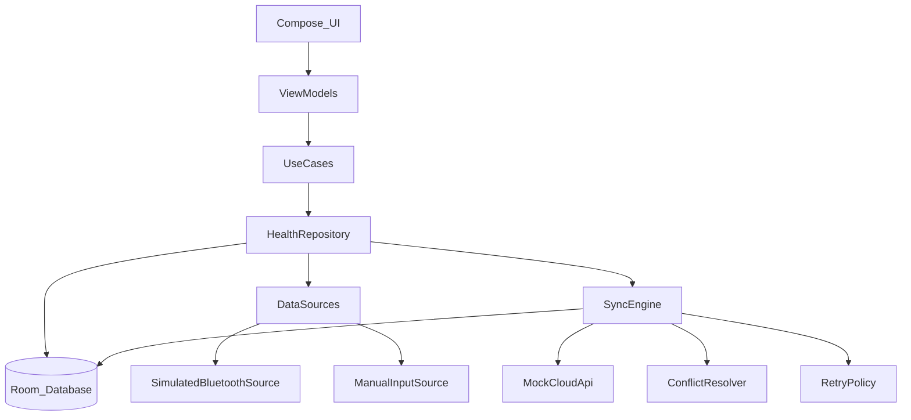

# HealthSync 设计文档（docs/DESIGN.md）

> 目标：以**数据层架构**为核心，完成“多数据源 + 离线优先 + 可恢复同步 + 冲突处理 + 可观测状态”的最小闭环；UI 仅用于验证链路。

---

## 1. 背景与范围 

### 1.1 背景
- 产品：智能手环 + 手机 App，同步心率/步数/睡眠数据。
- 本项目：不接真实蓝牙，使用模拟数据源；云端使用 mock REST API。

### 1.2 目标（Goals）
- **可扩展数据源**：新增真实蓝牙/Health Connect 数据源时，不修改同步引擎核心代码（只新增实现 + DI 注册）。
- **离线优先**：所有数据先写入 Room；网络同步异步进行。
- **可恢复同步**：同步中杀进程/重启后，可恢复未完成任务。
- **同步状态可见**：每条数据有状态（本地/同步中/已同步/失败/冲突），UI 可汇总待同步数量。
- **冲突可处理**：实现并记录冲突策略（睡眠记录离线修改导致冲突）。
- **可测试**：数据层核心逻辑单元测试覆盖率 > 60%（重试/状态机/冲突/并发写入）。

### 1.3 非目标（Non-Goals）
- 不实现真实蓝牙协议、真实云端、账号体系。
- 不追求 UI 完整度与视觉完美；优先证明数据链路与可靠性。

---

## 2. 架构总览

### 2.1 分层与职责
- **UI（Jetpack Compose）**：只渲染 `ViewModel` 暴露的 `StateFlow`；触发“下拉刷新同步”等意图。
- **ViewModel（MVVM）**：聚合多个 Flow 为 UI 状态；发起同步/录入睡眠等 UseCase。
- **Domain（UseCases）**：定义业务入口（开始/停止数据源、触发同步、保存睡眠、订阅汇总指标）。
- **Data Layer**：
  - `DataSource`：统一抽象“数据产生”，提供数据流与连接状态流。
  - `Repository`：统一入口，写入 Room、读取 Flow、聚合统计（待同步数量等）。
  - `SyncEngine`：扫描 outbox/待同步记录；上传 mock API；指数退避重试；冲突处理；恢复策略。
  - `Room`：事实来源（source of truth），承载状态机字段与重试计划字段。
  - `CloudApi`：mock REST，模拟网络延迟与失败。
- **DI（Hilt/Koin）**：绑定接口到实现；新增数据源只需新增 binding。

### 2.2 依赖关系图（Mermaid）

---

## 3. 关键设计决策（至少 3 个）

> 写作模板：**备选方案** → **为什么选择** → **trade-off**。

### 3.1 决策 1：Room 作为事实来源（离线优先）
- **备选**：内存缓存为主、Room 只做缓存；或网络直写 + 本地补写。
- **选择**：Room 为事实来源，任何数据先落库；同步引擎只从 Room 扫描待同步数据。
- **trade-off**：需要更多表字段/状态维护；写入路径必须稳定可靠。

### 3.2 决策 2：outbox + 状态机驱动同步（而不是 UI/VM 直接调 API）
- **备选**：ViewModel 触发上传并持有队列；或只依赖 WorkManager 的一次性任务。
- **选择**：在 Room 持久化 `syncState/attemptCount/nextAttemptAt/lastError`，同步引擎周期扫描并推进状态。
- **trade-off**：实现更复杂，但带来可恢复、可观测、可测试。

### 3.3 决策 3：睡眠冲突策略 = “保留双方并标记冲突”
- **备选**：LWW（客户端优先/服务端优先）；字段级合并。
- **选择**：遇到冲突时不丢数据，将记录置为 `CONFLICT`，并存储服务端快照（或单独表）。
- **trade-off**：需要额外状态与后续处理（可先不做 UI，只要状态可被观测/导出）；实现复杂度高于 LWW。

---

## 4. 数据源抽象（可扩展）

### 4.1 统一接口（概念）
- **输出 1：数据事件流**（Flow）
  - 心率样本、步数增量、睡眠记录变更等事件统一封装为 `HealthEvent`。
- **输出 2：连接/健康状态流**（Flow）
  - 用于模拟“蓝牙断连”，UI 可提示但不崩溃。
- **可取消**：通过协程取消停止数据源。

### 4.2 数据源实现要求
- **SimulatedBluetoothSource**
  - 每 2 秒：产生 1 条心率（60–120 随机）
  - 每 30 秒：产生 1 次步数增量（例如 1–20 随机）
  - 支持模拟断连：断连时停止产生数据，并发出 Disconnected 状态（可在一段时间后重连）
- **ManualInputSource**
  - 用户录入/修改睡眠记录（新增、编辑都走同一写入通道）
  - 必须能在离线状态下修改“已同步”的记录，以触发冲突链路

---

## 5. 本地数据模型与同步状态机

### 5.1 同步状态（建议）
- `LOCAL_PENDING`：本地新增/修改，待同步
- `SYNCING`：同步引擎已抢占处理
- `SYNCED`：已与云端一致
- `SYNC_FAILED`：超过最大重试次数
- `CONFLICT`：检测到冲突，保留双方版本等待后续处理

### 5.2 outbox 字段（建议）
对所有可同步记录（心率/步数/睡眠）至少持久化：
- `syncState`
- `attemptCount`（从 0 开始）
- `nextAttemptAt`（下次允许重试的时间戳）
- `lastError`（可选：短字符串/错误码，便于 UI/调试）
- `remoteId` 或 `remoteVersion`（用于幂等与冲突检测）

### 5.3 并发写入保证
原则：**所有写入通过 Repository/DAO，避免 UI 或数据源直接操作数据库**。
- Room 本身线程安全，但需要：
  - 合理主键策略（自增 id 或稳定业务键）
  - 必要时用事务（例如“抢占同步任务”）

---

## 6. 同步引擎（SyncEngine）

### 6.1 触发方式
- **自动周期**：App 启动后定时；或交给 WorkManager（可选）
- **手动刷新**：历史页下拉刷新触发一次同步

### 6.2 同步流程（高层）
1. 查询待同步记录：`syncState in (LOCAL_PENDING, SYNC_FAILED)` 且 `nextAttemptAt <= now`
2. 抢占任务：事务内将记录标记为 `SYNCING`（避免重复上传）
3. 调用 `MockCloudApi` 上传（模拟 delay 与失败）
4. 成功：写回 `SYNCED` + `remoteId/remoteVersion` + 清理错误字段
5. 失败：计算指数退避，更新 `attemptCount/nextAttemptAt/lastError`
6. 超过 3 次：置为 `SYNC_FAILED`

### 6.3 指数退避策略（RetryPolicy）
建议参数（可配置）：
- `maxAttempts = 3`
- `baseDelay = 2s` 或 `5s`
- 第 n 次失败后 delay：`baseDelay * 2^(n-1)`（可加少量 jitter）

### 6.4 杀进程恢复策略（必须说明）
启动恢复时处理 `SYNCING`：
- 策略 A（建议）：启动时将长期停留的 `SYNCING` 重置为 `LOCAL_PENDING` 并保留 `attemptCount`
- 原因：应用被杀时无法确认上传是否完成；回到 pending 可重新推进，配合幂等 remoteId/版本避免重复副作用

---

## 7. 冲突检测与解决（睡眠记录）

### 7.1 冲突检测
推荐使用版本号或时间戳：
- 本地：`localVersion`（每次本地编辑 +1），并记录 `baseRemoteVersion`（编辑时看到的远端版本）
- 云端：`remoteVersion`
当同步时发现 `baseRemoteVersion < currentRemoteVersion` 则判定冲突。

### 7.2 解决策略：保留双方并标记冲突（本项目采用）
- 同步时发现冲突：
  - 将该条记录置为 `CONFLICT`
  - 存储 `serverSnapshot`（可选：单独表存服务端版本内容 + 版本号）
- 后续处理（可选，不强制 UI）：
  - 提供一个 UseCase：选择“采用本地/采用云端/合并后提交”，从而解除冲突并进入正常同步

### 7.3 为什么选这个策略
- 优点：**不丢数据**，可审计，适合离线编辑场景；面试展示“可靠性优先”。
- 缺点：需要额外状态与后续处理入口；实现与测试更复杂。

---

## 8. 端到端数据流（心率样本）

> 必须完整描述“产生 → 落库 → 展示 → 同步”链路。

1. **产生**：`SimulatedBluetoothSource` 每 2 秒发出 `HeartRateSample(timestamp,bpm,sourceId)`
2. **落库**：`Repository` 将其写入 `HeartRateEntity(syncState=LOCAL_PENDING, attemptCount=0)`
3. **展示**：
   - DAO 提供 `Flow`（按时间范围查询最近 5 分钟）
   - ViewModel 将其映射为 UI state（当前值 + 图表点集）
   - Compose 订阅 `StateFlow` 实时重组
4. **同步**：
   - `SyncEngine` 扫描 `LOCAL_PENDING` 心率记录
   - 上传至 `MockCloudApi`（delay + fail）
   - 成功写回 `SYNCED`，失败按退避重试

---

## 9. 异常场景处理（隐藏考点）

- **数据源断连**：\n
  - 数据源发出 Disconnected 状态（Flow）；UI 显示提示但继续展示历史数据\n
  - App 不崩溃；断连不影响 Room 已落库的数据\n
- **同步中杀进程**：\n
  - `SYNCING` 状态可被启动恢复逻辑重置并继续同步\n
  - 重试计划持久化在 Room\n
- **并发写入**：\n
  - 两个数据源同时写入，DAO/事务保证不丢数据\n

---

## 10. 测试策略（数据层核心逻辑）

### 10.1 必测用例
- `RetryPolicy`：指数退避计算正确，最多 3 次
- `SyncEngine`：`LOCAL_PENDING -> SYNCING -> SYNCED`；失败进入退避并最终 `SYNC_FAILED`
- 并发写入：两个协程写入后数据完整且条数正确
- 冲突：构造远端版本变化 + 本地离线编辑，断言进入 `CONFLICT` 并保存 serverSnapshot

### 10.2 测试约束
- 避免真实 `delay`：使用测试调度器/可控时间（虚拟时间推进）
- API 使用 fake/mock：可配置成功/失败/延迟

---

## 11. 目录结构建议（可选）
- `app/src/main/.../data/`：Room、Repository、SyncEngine、Api、DataSources
- `app/src/main/.../domain/`：UseCases、domain models
- `app/src/main/.../ui/`：screens、components、ViewModels
- `docs/`：DESIGN、AI_LOG 等

